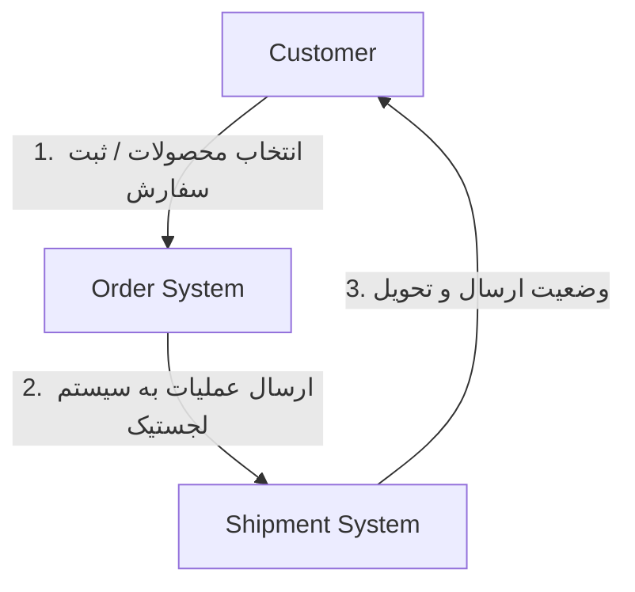
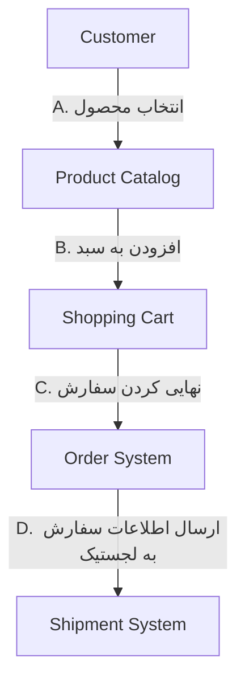
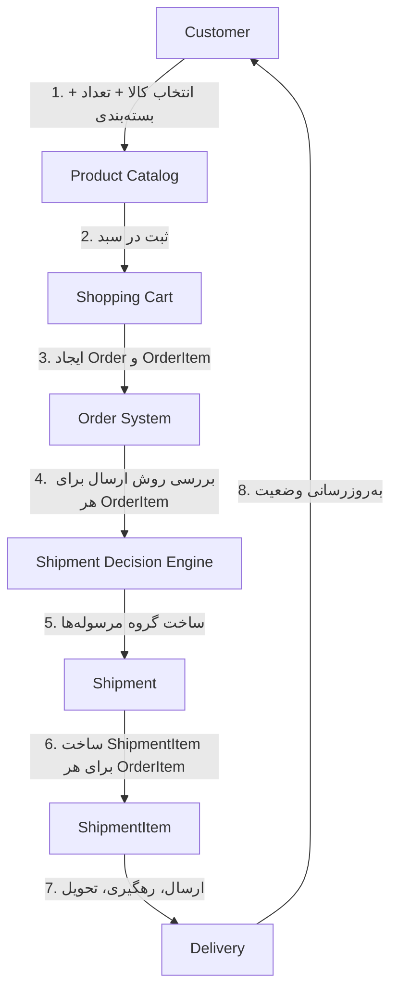
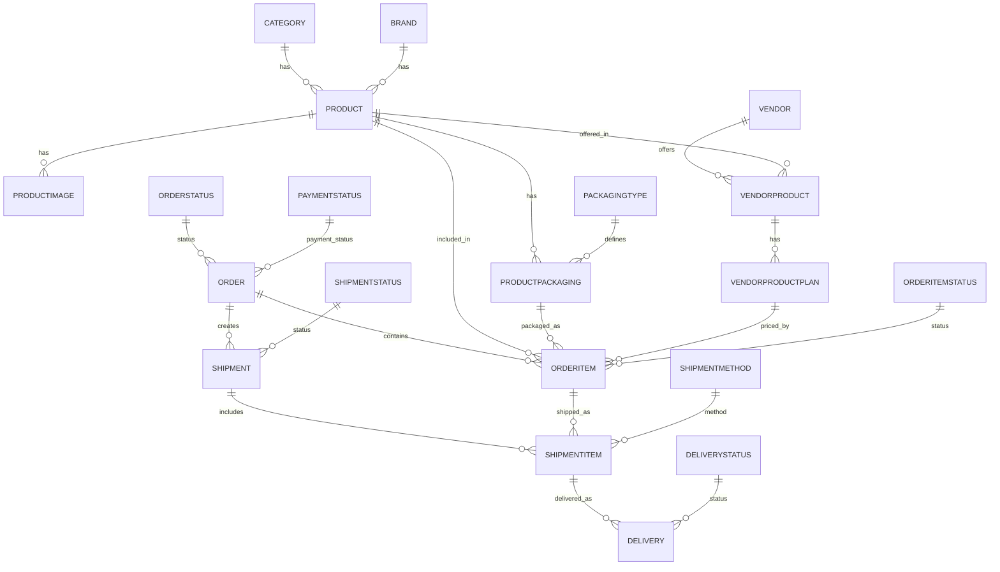
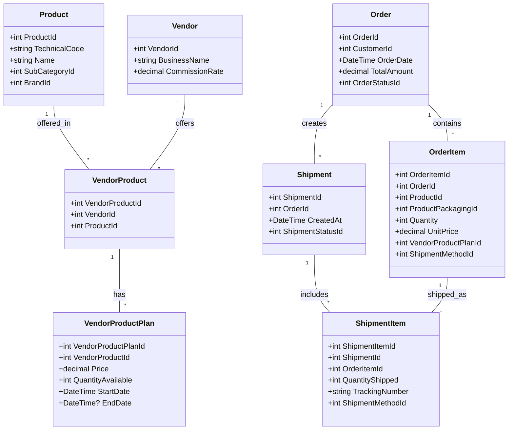
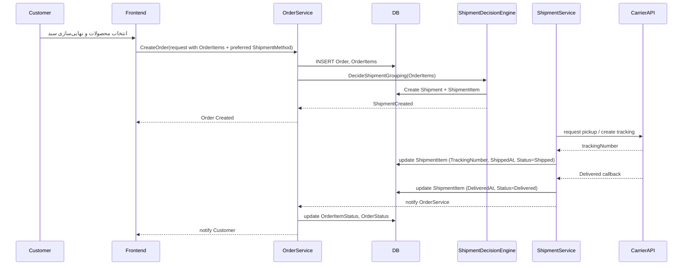

# Marketplace System Architecture

این فایل شامل تمام دیاگرام‌ها و جریان سیستم فروشگاه/Marketplace است.  

---

## 1️⃣ DFD Level 0 — نمای کلی سیستم

## 2️⃣ DFD Level 1 — زیرسیستم سفارش

## 3️⃣ DFD Level 2 — جریان سفارش تا تحویل

## 4️⃣ ERD — روابط دیتابیس

## 5️⃣ Class Diagram — مدل EF Core

## 6️⃣ Sequence Diagram — جریان سفارش تا تحویل

