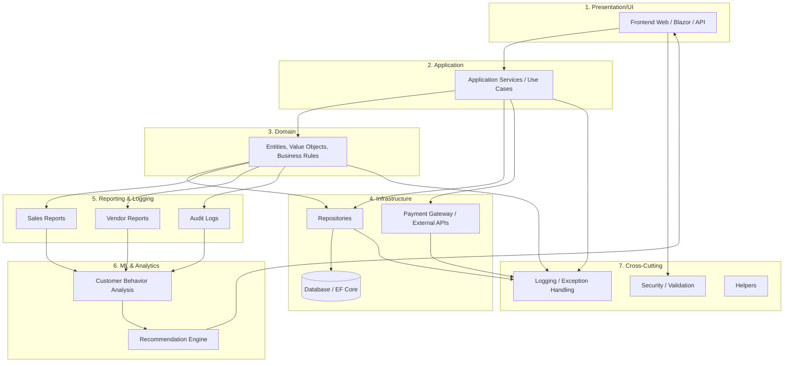

# Marketplace 7-Layer Architecture

این فایل شامل دیاگرام و توضیح لایه‌های هفت‌گانه پروژه Marketplace است. تمام دیاگرام‌ها با **Mermaid** نوشته شده و قابل رندر در GitHub هستند.

---

## 1️⃣ Mermaid Diagram — 7 Layer Architecture

